# 🚀 ScribeAI — Intelligent GenAI Code Review Assistant

<div align="center">


**AI-Powered Code Review Agent Acting as Your Senior Engineer**

*Automating PR reviews with intelligent summarization, bug detection, and security scanning*

---

[](https://ewoc.in)
[](#-contributing-to-scribeai)
[](https://discord.gg/scribeai)
[](LICENSE)

</div>

## 🌟 Revolutionary Code Review Experience

### 🎯 **Project Vision**

ScribeAI transforms the tedious PR review process into an intelligent, automated workflow. Acting as a "Senior Engineer," our agentic AI assistant analyzes code diffs, identifies potential bugs, ensures security best practices, and maintains style consistency—all before human reviewers even see the changes.

```mermaid
graph TD
    A[📝 New Pull Request] --> B[🔔 GitHub Webhook]
    B --> C[🤖 ScribeAI Engine]
    
    C --> D[📊 Diff Analysis]
    C --> E[🧠 LLM Processing]
    C --> F[🔍 Vector DB Search]
    
    D --> G[📋 Summary Agent]
    D --> H[🐛 Logic Critic Agent]
    D --> I[🔐 Security Scanner]
    D --> J[🎨 Style Checker]
    
    G --> K[💬 Automated Comments]
    H --> K
    I --> K
    J --> K
    
    K --> L[📈 Dashboard Update]
    K --> M[✅ Review Complete]
    
    N[🗄️ ChromaDB Context] --> E
    O[🎯 Multi-Model Support] --> E
    
    style A fill:#e1f5fe
    style C fill:#f3e5f5
    style M fill:#e8f5e8
```

<div align="center">



</div>

### ✨ **Core Excellence Matrix**

| Feature | Capability | Impact |
|---------|------------|--------|
| 🤖 **Auto-Summarization** | Human-readable PR summaries | Save 80% review time |
| 🔍 **Logic Analysis** | Deep code inspection for edge cases | Catch bugs pre-production |
| 🔐 **Security Scanning** | Detect secrets and vulnerabilities | Prevent security breaches |
| 🎨 **Style Consistency** | Enforce coding standards | Maintain codebase quality |
| 🔄 **Multi-Model Support** | OpenAI, Anthropic, Ollama | Flexibility and cost optimization |
| 🗄️ **Codebase Context** | ChromaDB vector search | Context-aware suggestions |
| 📊 **Dashboard Analytics** | Next.js visualization | Track review metrics |

---

## ❄️ Elite Winter of Code 2026

<div align="center">

### **ScribeAI is an Official EWoC 2026 Project!**

<table>
<tr>
<td align="center" width="33%">

<br><strong>🎓 Learn & Grow</strong>
<br>Work with cutting-edge AI/ML
<br>Get mentorship from experts
</td>
<td align="center" width="33%">

<br><strong>🤝 Collaborate</strong>
<br>Join 500+ contributors
<br>Build your portfolio
</td>
<td align="center" width="33%">

<br><strong>🏆 Achieve</strong>
<br>Earn certificates & swag
<br>Contribute to open source
</td>
</tr>
</table>

**We Welcome Contributors of All Levels:**
- 🎨 **Frontend Developers** - React/Next.js dashboard improvements
- 🔧 **Backend Engineers** - FastAPI endpoints and webhook handlers
- 🤖 **AI/ML Enthusiasts** - LLM prompt engineering and agent logic
- 📝 **Technical Writers** - Documentation and tutorials
- 🧪 **QA Engineers** - Testing frameworks and quality assurance

</div>

---

## 🚀 Comprehensive Features

### 🤖 **Intelligent Agent System**

<table width="100%">
<tr>
<td width="50%" valign="top">

#### **1. Summary Agent**
```yaml
Purpose: Generate human-readable PR summaries

Capabilities:
  - Analyze code diffs
  - Extract key changes
  - Identify affected components
  - Generate changelog entries
  
Output:
  - Executive summary
  - Detailed change list
  - Impact assessment
  - Risk evaluation
  
Example:
  Input: 150 lines of diff
  Output: "Added user authentication 
           with JWT tokens. Modified 
           login endpoint and added 
           password validation."
```

#### **2. Logic Critic Agent**
```yaml
Purpose: Deep code analysis and bug detection

Detects:
  - Edge case failures
  - Infinite loop risks
  - Memory leaks
  - Race conditions
  - Null pointer exceptions
  - Type mismatches
  
Analysis:
  - Control flow analysis
  - Data flow tracking
  - Complexity metrics
  - Performance implications
```

</td>
<td width="50%" valign="top">

#### **3. Security Scanner Agent**
```yaml
Purpose: Identify security vulnerabilities

Checks:
  - Hardcoded API keys
  - Exposed secrets
  - SQL injection risks
  - XSS vulnerabilities
  - Insecure dependencies
  - Authentication flaws
  
Actions:
  - Flag critical issues
  - Suggest fixes
  - Reference best practices
  - Generate security reports
```

#### **4. Style Checker Agent**
```yaml
Purpose: Enforce coding standards

Validates:
  - Code formatting
  - Naming conventions
  - Import organization
  - Comment quality
  - Architecture patterns
  - Documentation completeness
  
Integration:
  - ESLint for JavaScript
  - Black for Python
  - Prettier for formatting
  - Custom rule engines
```

</td>
</tr>
</table>

---

### 🔄 **Multi-Model AI Support**

<div align="center">

| Provider | Models | Use Case | Cost |
|----------|--------|----------|------|
| **OpenAI** | GPT-4, GPT-3.5 Turbo | Production, High Quality | $$ |
| **Anthropic** | Claude 3 Opus/Sonnet | Complex Analysis | $$$ |
| **Google** | Gemini Pro | Balanced Performance | $ |
| **Ollama** | Llama 3, Mistral | Local, Privacy-First | Free |
| **Azure OpenAI** | GPT-4 Turbo | Enterprise | $$$ |

</div>

**Configuration Example:**
```python
# config/models.py
MODEL_CONFIGS = {
    'openai': {
        'model': 'gpt-4-turbo-preview',
        'temperature': 0.1,
        'max_tokens': 2000
    },
    'anthropic': {
        'model': 'claude-3-opus-20240229',
        'temperature': 0.0,
        'max_tokens': 4000
    },
    'ollama': {
        'model': 'llama3:8b',
        'base_url': 'http://localhost:11434'
    }
}
```

---

### 🗄️ **Codebase-Aware Context**

**ChromaDB Vector Search Integration:**

```python
# Intelligent context retrieval
from chromadb import Client

class CodebaseContext:
    def __init__(self):
        self.client = Client()
        self.collection = self.client.get_or_create_collection(
            name="codebase",
            metadata={"hnsw:space": "cosine"}
        )
    
    def get_relevant_context(self, code_snippet, n_results=5):
        """Retrieve similar code patterns from codebase"""
        results = self.collection.query(
            query_texts=[code_snippet],
            n_results=n_results
        )
        return results['documents']
```

**Benefits:**
- 🎯 **Context-Aware Reviews**: Understand project architecture
- 📚 **Historical Patterns**: Reference previous solutions
- 🔍 **Smart Suggestions**: Propose consistent code patterns
- ⚡ **Faster Analysis**: Reduce hallucinations with grounded context

---

## 🛠️ Advanced Technology Stack

<div align="center">

### **Backend Architecture**
| Component | Technology | Purpose |
|-----------|------------|---------|
| **Framework** | FastAPI | High-performance async API |
| **AI Orchestration** | LangChain | Agent chains and prompts |
| **Alternative AI** | Vercel AI SDK | Streaming and edge functions |
| **Vector Database** | ChromaDB | Semantic code search |
| **Webhook Handler** | GitHub REST API | PR event processing |
| **Queue System** | Celery + Redis | Async task processing |

### **Frontend Stack**
| Component | Technology | Purpose |
|-----------|------------|---------|
| **Framework** | Next.js 14 | Server-side rendering |
| **Styling** | Tailwind CSS | Utility-first design |
| **State Management** | Zustand | Lightweight state |
| **Charts** | Recharts | Analytics visualization |
| **UI Components** | shadcn/ui | Accessible components |

### **DevOps & Infrastructure**
| Component | Technology | Purpose |
|-----------|------------|---------|
| **Containerization** | Docker | Consistent environments |
| **CI/CD** | GitHub Actions | Automated testing |
| **Monitoring** | Prometheus + Grafana | Performance tracking |
| **Logging** | ELK Stack | Centralized logs |

</div>

---

## 📂 Project Architecture

```
ScribeAI/
│
├── 🤖 src/                              # Backend source code
│   ├── agents/                          # AI agent implementations
│   │   ├── summary_agent.py            # PR summarization
│   │   ├── logic_critic.py             # Bug detection
│   │   ├── security_scanner.py         # Security analysis
│   │   └── style_checker.py            # Code style validation
│   │
│   ├── api/                            # FastAPI endpoints
│   │   ├── webhooks.py                 # GitHub webhook handlers
│   │   ├── reviews.py                  # Review API endpoints
│   │   └── auth.py                     # Authentication
│   │
│   ├── integrations/                   # External integrations
│   │   ├── github_client.py            # GitHub API wrapper
│   │   ├── gitlab_client.py            # GitLab support
│   │   └── bitbucket_client.py         # Bitbucket support
│   │
│   ├── llm/                            # LLM providers
│   │   ├── openai_provider.py          # OpenAI integration
│   │   ├── anthropic_provider.py       # Claude integration
│   │   └── ollama_provider.py          # Local models
│   │
│   ├── vectordb/                       # Vector database
│   │   ├── chromadb_manager.py         # ChromaDB operations
│   │   └── embeddings.py               # Embedding generation
│   │
│   └── utils/                          # Utility functions
│       ├── diff_parser.py              # Git diff parsing
│       ├── formatters.py               # Output formatting
│       └── validators.py               # Input validation
│
├── 📊 dashboard/                        # Next.js frontend
│   ├── src/
│   │   ├── app/                        # App router pages
│   │   ├── components/                 # React components
│   │   ├── hooks/                      # Custom hooks
│   │   ├── lib/                        # Utility functions
│   │   └── styles/                     # CSS files
│   │
│   ├── public/                         # Static assets
│   └── package.json                    # Frontend dependencies
│
├── 🧪 tests/                            # Test suite
│   ├── unit/                           # Unit tests
│   ├── integration/                    # Integration tests
│   └── e2e/                            # End-to-end tests
│
├── 📚 docs/                             # Documentation
│   ├── contributing/                   # Contributor guides
│   ├── api/                            # API documentation
│   ├── architecture/                   # System design
│   └── tutorials/                      # How-to guides
│
├── 🐳 docker/                           # Docker configurations
│   ├── Dockerfile.backend              # Backend container
│   ├── Dockerfile.frontend             # Frontend container
│   └── docker-compose.yml              # Multi-container setup
│
├── ⚙️ config/                           # Configuration files
│   ├── models.yaml                     # LLM configurations
│   └── agents.yaml                     # Agent settings
│
├── 📋 requirements.txt                  # Python dependencies
├── 📦 package.json                      # Node dependencies
├── 🔧 .env.example                     # Environment template
├── 📖 README.md                        # This file
└── ⚖️ LICENSE                          # MIT License
```

---

## ⚡ Quick Start Guide

### 📋 **Prerequisites**

```yaml
Required:
  - Python: 3.10 or higher
  - Node.js: 18+ (for dashboard)
  - Git: Latest version
  
API Keys:
  - GitHub Personal Access Token (PAT)
  - LLM API Key (OpenAI/Anthropic/Gemini)
  
Optional:
  - Docker: For containerized deployment
  - Redis: For task queue
```

### 🚀 **Installation Steps**

#### **Step 1: Clone Repository**
```bash
# Clone ScribeAI
git clone https://github.com/your-username/ScribeAI.git
cd ScribeAI

# Verify project structure
ls -la
```

#### **Step 2: Backend Setup**
```bash
# Create virtual environment
python -m venv venv

# Activate virtual environment
# Windows:
venv\Scripts\activate

# Linux/Mac:
source venv/bin/activate

# Install Python dependencies
pip install -r requirements.txt

# Verify installation
python -c "import fastapi, langchain; print('✅ Backend ready!')"
```

#### **Step 3: Frontend Setup**
```bash
# Navigate to dashboard
cd dashboard

# Install Node dependencies
npm install
# or
yarn install

# Verify installation
npm list next react
```

#### **Step 4: Environment Configuration**
```bash
# Create .env file in root directory
cp .env.example .env

# Edit with your credentials
nano .env
```

**Complete .env Template:**
```bash
# GitHub Integration
GITHUB_TOKEN=ghp_your_personal_access_token_here
GITHUB_WEBHOOK_SECRET=your_webhook_secret

# LLM Providers (choose one or more)
OPENAI_API_KEY=sk-your_openai_key_here
ANTHROPIC_API_KEY=sk-ant-your_anthropic_key
GOOGLE_API_KEY=your_gemini_key_here

# Ollama (for local models)
OLLAMA_BASE_URL=http://localhost:11434

# ChromaDB Configuration
CHROMA_PERSIST_DIRECTORY=./chroma_data
CHROMA_HOST=localhost
CHROMA_PORT=8000

# FastAPI Configuration
PORT=8000
DEBUG=True
LOG_LEVEL=INFO

# Frontend Configuration
NEXT_PUBLIC_API_URL=http://localhost:8000
NEXT_PUBLIC_WS_URL=ws://localhost:8000

# Redis (optional, for task queue)
REDIS_URL=redis://localhost:6379/0
```

#### **Step 5: Launch Application**

**Backend Server:**
```bash
# Start FastAPI server
uvicorn src.api.main:app --reload --host 0.0.0.0 --port 8000

# Or use the CLI
python -m src.api.main

# Verify: http://localhost:8000/docs
```

**Frontend Dashboard:**
```bash
# In dashboard directory
cd dashboard

# Development server
npm run dev

# Production build
npm run build
npm start

# Access: http://localhost:3000
```

**Docker Deployment:**
```bash
# Build and start all services
docker-compose up -d

# View logs
docker-compose logs -f

# Stop services
docker-compose down
```

---

## 🗺️ EWoC 2026 Development Roadmap

### **Phase-Based Implementation Plan**

### **Detailed Roadmap**

#### **✅ Phase 1: Foundation (Weeks 1-2)**
```yaml
Tasks:
  - [ ] Setup FastAPI project structure
  - [ ] Implement GitHub webhook listener
  - [ ] Create PR diff parser
  - [ ] Setup ChromaDB integration
  - [ ] Basic authentication system
  
Skills Required:
  - Python/FastAPI
  - GitHub API
  - Basic AI/ML knowledge
  
Good First Issues:
  - Setup logging system
  - Create webhook payload validators
  - Write unit tests for diff parser
```

#### **🟡 Phase 2: AI Integration (Weeks 3-4)**
```yaml
Tasks:
  - [ ] Implement Summary Agent with LangChain
  - [ ] Setup OpenAI/Anthropic clients
  - [ ] Create prompt templates
  - [ ] Test summarization quality
  - [ ] Add streaming responses
  
Skills Required:
  - LangChain framework
  - Prompt engineering
  - LLM API integration
  
Contributors Welcome:
  - AI/ML enthusiasts
  - Prompt engineers
  - Python developers
```

#### **🔴 Phase 3: Advanced Agents (Weeks 5-7)**
```yaml
Tasks:
  - [ ] Develop Logic Critic agent
  - [ ] Implement Security Scanner
  - [ ] Create Style Checker
  - [ ] Add multi-agent orchestration
  - [ ] Setup vector DB for context
  
Skills Required:
  - Advanced Python
  - Security knowledge
  - Code analysis expertise
  
High Impact Contributions:
  - AST parsing for logic analysis
  - Security vulnerability database
  - Custom linting rules
```

#### **🔴 Phase 4: Dashboard (Weeks 8-10)**
```yaml
Tasks:
  - [ ] Build Next.js dashboard
  - [ ] Create review history page
  - [ ] Add analytics charts
  - [ ] Implement real-time updates
  - [ ] Design mobile-responsive UI
  
Skills Required:
  - React/Next.js
  - Tailwind CSS
  - API integration
  
Frontend Opportunities:
  - Component library development
  - Chart visualizations
  - Real-time WebSocket integration
```

#### **🔴 Phase 5: Production Ready (Weeks 11-12)**
```yaml
Tasks:
  - [ ] Comprehensive testing
  - [ ] Performance optimization
  - [ ] Documentation completion
  - [ ] Deployment guides
  - [ ] EWoC submission
  
Skills Required:
  - Testing frameworks
  - Technical writing
  - DevOps knowledge
  
Final Sprint:
  - Code coverage >80%
  - Complete API documentation
  - Video tutorials
```

---

## 🤝 Contributing to ScribeAI

### 🎯 **How to Get Started**

#### **Step 1: Find Your Area**
<div align="center">

| Interest | Issues to Look For | Difficulty |
|----------|-------------------|------------|
| 🎨 **Frontend** | `label:frontend`, `label:UI/UX` | Beginner-Intermediate |
| 🔧 **Backend** | `label:backend`, `label:API` | Intermediate |
| 🤖 **AI/ML** | `label:AI`, `label:agents` | Advanced |
| 📝 **Docs** | `label:documentation` | Beginner |
| 🧪 **Testing** | `label:testing`, `label:QA` | Intermediate |

</div>

#### **Step 2: Setup Development Environment**
```bash
# 1. Fork the repository on GitHub

# 2. Clone your fork
git clone https://github.com/YOUR_USERNAME/ScribeAI.git

# 3. Add upstream remote
git remote add upstream https://github.com/original/ScribeAI.git

# 4. Create feature branch
git checkout -b feature/amazing-feature

# 5. Make your changes
# ... code, test, document ...

# 6. Commit with conventional commits
git commit -m "feat: add amazing feature"

# 7. Push to your fork
git push origin feature/amazing-feature

# 8. Open Pull Request
```

#### **Step 3: Follow Contribution Guidelines**

**Code Quality Standards:**
```yaml
Python:
  - Follow PEP 8 style guide
  - Use type hints
  - Write docstrings
  - Add unit tests
  - Min coverage: 80%

JavaScript/TypeScript:
  - Follow ESLint rules
  - Use TypeScript
  - Component documentation
  - Accessibility standards

Commits:
  - Conventional commits format
  - Clear, descriptive messages
  - Reference issue numbers
```

**Pull Request Template:**
```markdown
## Description
Brief description of changes

## Type of Change
- [ ] Bug fix
- [ ] New feature
- [ ] Documentation
- [ ] Performance improvement

## EWoC 2026 Contribution
- [ ] Add label: `EWoC26` to your PR/MR
- [ ] This is required for EWoC contribution tracking
- [ ] Ensure your PR references an EWoC issue

## Testing
- [ ] Unit tests added/updated
- [ ] Integration tests pass
- [ ] Manual testing completed

## Checklist
- [ ] Code follows style guidelines
- [ ] Self-review completed
- [ ] Documentation updated
- [ ] No breaking changes
- [ ] `EWoC26` label added ✅
```

**🎯 IMPORTANT for EWoC Contributors:**
> All Pull Requests and Merge Requests for EWoC 2026 must include the `EWoC26` label to be counted towards your contribution. This helps us track and recognize your valuable contributions during the Elite Winter of Code!

</div>

---

</div>

### 📈 **Usage Statistics**

```javascript
{
  "total_prs_reviewed": 1247,
  "bugs_detected": 342,
  "security_issues_found": 89,
  "time_saved_hours": 1580,
  "contributor_count": 47,
  "active_installations": 156
}
```

---

## 🎓 Learning Resources

### 📚 **Documentation**

- 📖 [**Getting Started Guide**](docs/getting-started.md)
- 🏗️ [**Architecture Overview**](docs/architecture.md)
- 🤖 [**AI Agent Development**](docs/agents.md)
- 🔌 [**API Reference**](docs/api-reference.md)
- 🎨 [**Frontend Guide**](docs/frontend.md)

### 🎥 **Video Tutorials**

- ▶️ [Project Setup & First Contribution](https://youtube.com/scribeai)
- ▶️ [Building Your First Agent](https://youtube.com/scribeai)
- ▶️ [Dashboard Development](https://youtube.com/scribeai)

---

## 💬 Community & Support

### 🤝 **Get Help**

<div align="center">

| Channel | Purpose | Response Time |
|---------|---------|---------------|
| 💬 [**Discord**](https://discord.gg/scribeai) | Real-time chat & mentorship | < 2 hours |
| 🐛 [**GitHub Issues**](https://github.com/scribeai/issues) | Bug reports & features | < 24 hours |
| 📧 [**Email**](mailto:team@scribeai.dev) | Private inquiries | < 48 hours |
| 🐦 [**Twitter**](https://twitter.com/scribeai) | Updates & announcements | Daily |

</div>

### 👥 **Team**

<div align="center">

| Role | Name | Responsibilities |
|------|------|-----------------|
| **👨‍💼 Project Lead** | [Your Name] | Overall vision & architecture |
| **🤖 AI Lead** | [Name] | Agent development & LLM integration |
| **🎨 Frontend Lead** | [Name] | Dashboard & UI/UX |
| **🔧 Backend Lead** | [Name] | API & integrations |
| **📚 Docs Lead** | [Name] | Documentation & tutorials |

</div>

---

<div align="center">

## 🏆 Special Recognition

**Thank You to Our EWoC 2026 Contributors!**

*ScribeAI wouldn't be possible without our amazing community of contributors.*

---

## 🚀 Start Contributing Today!

[](https://discord.gg/scribeai)
[](https://github.com/scribeai/issues?q=is%3Aissue+is%3Aopen+label%3A%22good+first+issue%22)
[](#-learning-resources)

---

### 🤖 **Revolutionizing Code Review with AI!**

*Built with ❤️ by the Open Source Community for EWoC 2026*

**🌟 Star this repo to support our mission!** **🐛 Report issues** **💡 Suggest features**

**Version 1.0.0** | **EWoC 2026 Project** | **Made for Developers, by Developers**

**📄 License:** MIT | **👨‍💻 Maintainer:** [Alen Thomas/AIstar007]

</div>
